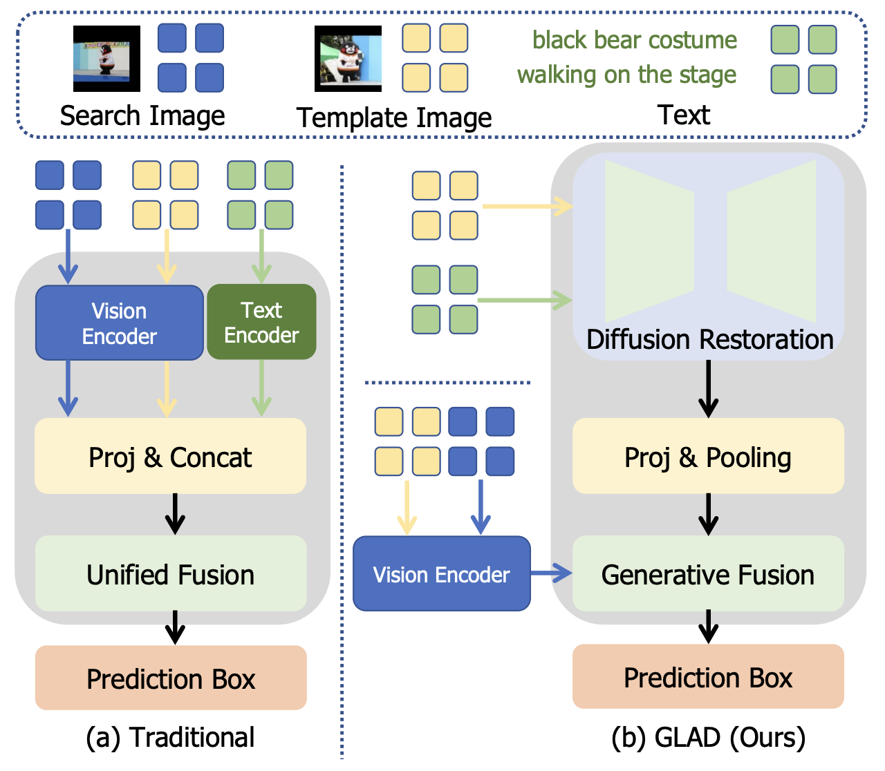
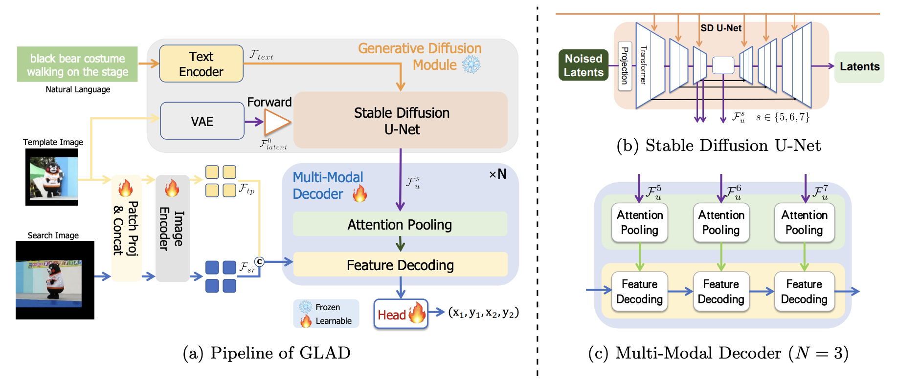

# GLAD
A Baseline Implementation to Employ Diffusion Feature for Vision-Language Tracking


# GLAD: Generative Language-Assisted Visual Tracking for Low-Semantic Templates

> [Xingyu Luo](https://github.com/Confetti-lxy),  [Yidong Cai](https://github.com/dawnyc), [Jie Liu](https://scholar.google.com/citations?user=oab9IRYAAAAJ), [Jie Tang](https://scholar.google.com/citations?user=ENJVDroAAAAJ), [Gangshan Wu](https://mcg.nju.edu.cn/member/gswu/index.html), [Limin Wang](https://scholar.google.com/citations?user=HEuN8PcAAAAJ)


[](https://arxiv.org/abs/2602.00570)
[](https://huggingface.co/Confetti/GLAD)

This is an official pytorch implementation of the paper **GLAD: Generative Language-Assisted Visual Tracking for Low-Semantic Templates**.


### 🔥 Updates

*   \[2/2026\] **GLAD's** code is available!
*   \[1/2026\] **GLAD**  is accepted by IJCV(CCF-A)

### 📣 Overview
#### Our motivation & Core modeling approach

Traditional vision-language trackers extract text features and send them directly into fusion stage, connections between text and visual representations are not sufficiently considered for this task. 
In cases of low-semantic templates, which we consider from the low clarity of the tracking target and the weak relevance to the text description, 
feature fusion is further hindered, which adversely affects the prediction results and leads to poor performance.
Besides, the inherent limitations of existing vision-language tracking models, which are predominantly discriminative in nature, relying on feature interaction between the text, template, and search region to generate the final bounding box. As a result, these models typically lack the generative capability to reconstruct or enhance input data.

In light of these challenges, we propose the generative fusion paradigm which focuses on leveraging a generative fusion to bolster compatibility between language and image. In contrast of discriminative models, generative models like Stable Diffusion possess stronger reconstruction abilities and can produce features during the generation process that are otherwise inaccessible to discriminative approaches. These features can act as a form of guidance, helping the model better understand and locate the target object. 



Based on this paradigm, we propose a new vision-language tracking method GLAD, which employs diffusion models to perform generative multi-modal fusion. Verified by experiments, our method surpasses most existing state-of-the-art vision-language trackers in terms of both tracking accuracy and inference speed on LaSOT, LaSOT_ext,  TNL2K and OTB99-lang.


#### Strong performance


### 🔨 Installation
```
conda create -n glad python=3.8
conda activate glad
pip install -r requirements.txt
```

### 🔧 Usage

#### Data Preparation
Our GLAD is trained on  LaSOT, TNL2K, RefCOCOg, OTB99-Lang, GOT-10k, and TrackingNet datasets.  
Put these tracking datasets in [./data](data). It should look like:

   ```
   ${GLAD_ROOT}
    -- data
        -- lasot
            |-- airplane
            |-- basketball
            |-- bear
            ...
        -- got10k
            |-- test
            |-- train
            |-- val
        -- OTB2015
            |-- Basketball
            |-- Biker
            |-- Bird1
            ...
        -- coco
            |-- annotations
            |-- images
        -- trackingnet
            |-- TRAIN_0
            |-- TRAIN_1
            ...
            |-- TRAIN_11
            |-- TEST
        -- tnl2k
            -- train
                |-- Arrow_Video_ZZ04_done
                |-- Assassin_video_1-Done
                |-- Assassin_video_2-Done
                ...
            -- test
                |-- advSamp_Baseball_game_002-Done
                |-- advSamp_Baseball_video_01-Done
                |-- advSamp_Baseball_video_02-Done
                ...

   ```

#### Set project paths
Run the following command to set paths for this project
```
python tracking/create_default_local_file.py --workspace_dir . --data_dir ./data --save_dir .
```
After running this command, you can also modify paths by editing these two files
```
lib/train/admin/local.py  # paths about training
lib/test/evaluation/local.py  # paths about testing
```

#### Train
##### Prepare pretrained backbone
The backbone and patch embedding of GLAD are initialized with pre-trained weights from [MAE ViT](https://github.com/facebookresearch/mae), and we adopt text encoder from [SDv1.5](https://huggingface.co/stable-diffusion-v1-5/stable-diffusion-v1-5) as our text encoder.  
Please download the **mae_pretrain_vit_base.pth**, **mae_pretrain_vit_large.pth**, **lcm-lora-sdv1-5** and **stable-diffusion-v1-5** checkpoints and place them in [./resource/pretrained](./resource/pretrained_models).

##### Train GLAD
You can run the following command to train the GLAD-B256:
```
python tracking/train.py --script GLAD --config baseline --save_dir $save_dir --mode deepspeed --nproc_per_node $gpu_num --gpu_vis $gpu_vis --master_port $MASTER_PORT --config_file experiments/deepspeed/ds_bf16_z2_config.json --precision bf16
```

Besides, you can run the following command to train the GLAD-L384:
```
python tracking/train.py --script GLAD --config baseline_large --save_dir $save_dir --mode deepspeed --nproc_per_node $gpu_num --gpu_vis $gpu_vis --master_port $MASTER_PORT --config_file experiments/deepspeed/ds_bf16_z2_config_large.json --precision bf16
```

#### Test and evaluate on benchmarks
First, you need to set the paths for the various evaluation benchmarks in [./lib/test/evaluation/local.py](./lib/test/evaluation/local.py), and prepare the model weights for evaluation. 
Then, run the following command to perform evaluation on different benchmarks (taking GLAD_base as an example).
- LaSOT
```
CUDA_VISIBLE_DEVICES=$gpu_vis python tracking/test.py GLAD baseline --dataset lasot --threads 32 --num_gpus $gpu_num --params__model $checkpoint_dir --params__search_area_scale 4.0
python tracking/analysis_results.py --dataset_name lasot --tracker_param baseline
```
- LaSOT_ext
```
CUDA_VISIBLE_DEVICES=$gpu_vis python tracking/test.py GLAD baseline --dataset lasot_ext --threads 32 --num_gpus $gpu_num --params__model $checkpoint_dir --params__search_area_scale 4.0
python tracking/analysis_results.py --dataset_name lasot_ext --tracker_param baseline
```

- TNL2K
```
CUDA_VISIBLE_DEVICES=$gpu_vis python tracking/test.py GLAD baseline --dataset tnl2k --threads 32 --num_gpus $gpu_num --params__model $checkpoint_dir --params__search_area_scale 4.0
python tracking/analysis_results.py --dataset_name tnl2k --tracker_param baseline
```

- OTB99

```
CUDA_VISIBLE_DEVICES=$gpu_vis python tracking/test.py GLAD baseline --dataset otb99 --threads 32 --num_gpus $gpu_num --params__model $checkpoint_dir --params__search_area_scale 4.0
python tracking/analysis_results.py --dataset_name otb99 --tracker_param baseline
```

### 📊 Model Zoo
The trained models, and the raw tracking results are provided in the [](https://huggingface.co/Confetti/GLAD).


### ❤️Acknowledgement
We would like to express our gratitude to the following open-source repositories that our work is based on: [ROMTrack](https://github.com/dawnyc/ROMTrack).
Their contributions have been invaluable to this project.